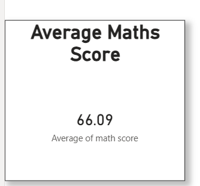
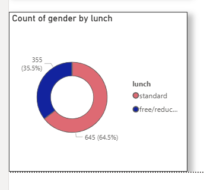
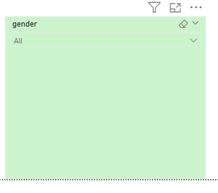
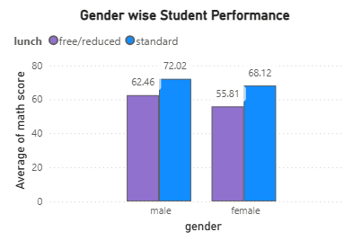
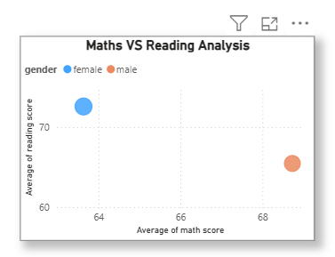
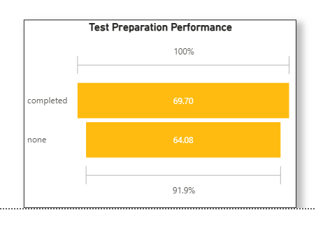

# Student Performance Dashboard

This project was developed using Python, SQL, and Power BI for student performance analysis and dashboard visualization.

## Technologies Used
- Python
- SQL
- Power BI
- Pandas
- NumPy

## Features
- Data Cleaning
- Student Performance Analysis
- Interactive Dashboard
- KPI Analysis
- Gender Based Analysis
- Test Preparation Insights

---

# Dashboard Screenshots

## Average Maths Score

## Count of Gender by Lunch

## Gender Analysis

## Genderwise Student Performance

## Maths VS Reading Analysis

## Test Preparation Performance

